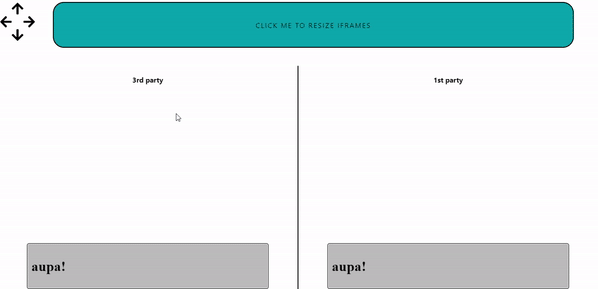

# Resizing Iframe Performance

## [LIVE DEMO](https://gfbgw.sse.codesandbox.io/)

<div style="border-style: dotted none dotted none; margin-bottom: 20px;"> 
 <div style="margin: 10px 0; font-size: 20px; font-weight: 700; color: red;">Important!</div>
 <p>This tests have been done using <b>Chrome Dev Version v.84</b>. The <b>flickering dissapears</b> using the <b>Chrome Stable v81</b>.</p>
</div>

As we use iframe's to inject our apps into another sites. This project is aimed to compare 3rd and 1st party `<iframe>` performance.

- The **3rd party** `<iframe>` is the one started in a more traditional way, setting up its _src_ attribute.
  ```HTML
  <iframe src="remotefile.html"/>
  ```
- The **1st party** one is started in a more _crafty_ way. After it's attached to the site's DOM, using JavaScript, we access it from the site and append files related to our apps (usually the bundle.js and the stylesheet).
  ```JavaScript
  const script = document.createElement("script");
  script.src = "https://simple-msg.netlify.app/inject.js";
  script.async = true;

  iframe.current.contentWindow.document.head.appendChild(script);
  ```

For this project, the main performance behaviour we wanted to test is how the iframe's content adapts to the iframe's resizing. And as we can see there is a clear difference, between the both, 3rd and 1st party. You can resize them yourself and check it on your own by clicking the button.



This "flickering" happens on the **bottom and right side** when you change the height or the width, respectively.

## Watch out for LocalStorage + Cookies

At first, it seems that is much better to start our `<iframe>` the _crafty_ way, but there is another major difference. Imagine we're on `www.somefancyshop.com`:

- Setting the _src_ attribute, we are also setting its domain. Thus the `<iframe src='mycompany.com/index.html' />` will have `mycompany.com` as a domain, and its local-storage and cookies will be related to `mycompany.com`, which is completely separeted from `somefancyshop.com`. That's because we name it as a **3r party** one.

- Starting it the _crafty_ way, we're creating its content form `somfancyshop.com` so the `<iframe>` would be **in the same domain, so it will be in the 1st party**. So the local-storage + cookies handled from the app inside the `<iframe>` will be the same as the main site, and **both will share information with other**.
